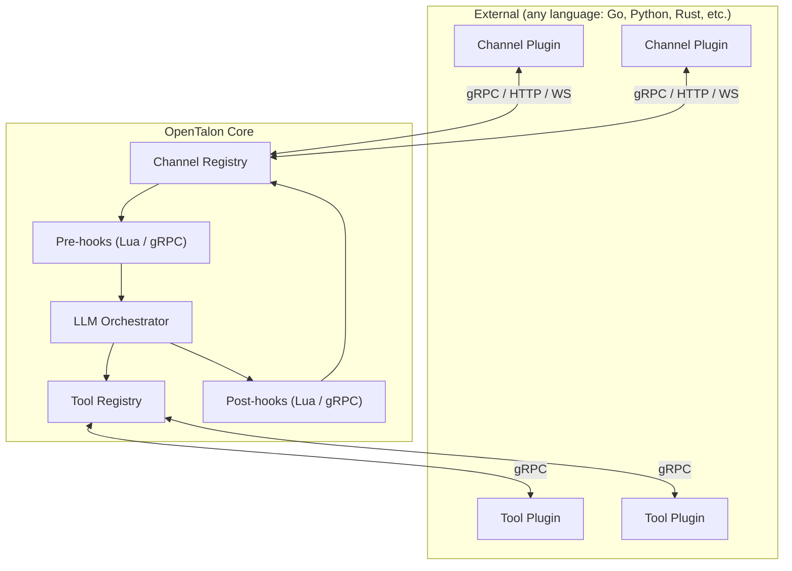

# Extensibility

OpenTalon is fully extensible. **Everything** is language-agnostic — plugins, channels, and hooks can be written in Go, Python, Rust, TypeScript, or any language that speaks gRPC. For lightweight scripting, an embedded Lua VM provides hot-reloadable hooks with zero deployment overhead.



There are **three extension categories**, all language-agnostic:

| Category | Purpose | Interface | Examples |
|---|---|---|---|
| **Tool plugins** | Capabilities the LLM invokes | gRPC (`PluginService`) | GitLab, Jira, code search, CI/CD |
| **Channel plugins** | I/O adapters for messaging platforms | gRPC / HTTP / WebSocket (`ChannelService`) | Slack, Teams, Telegram, WhatsApp, Discord |
| **Hooks** | Pre/post processing pipeline | Lua (embedded) or gRPC | Vocabulary enforcement, compliance, classification |

## Tool plugins (gRPC — any language)

For standalone capabilities the LLM calls: integrations, actions, data retrieval.

- **Language-agnostic** — write in Go, Python, Rust, or any language that speaks gRPC (Go is the primary SDK)
- Each plugin is a **separate binary** communicating over **gRPC via a local socket**
- **Process isolation** — a crashing plugin cannot take down the core
- **Security boundary** — strict protobuf contracts; plugins cannot access other plugins, the registry, or core internals
- **Discovery and lifecycle** — registered via config or auto-discovered from a directory, health-checked, and restarted on failure
- Same proven pattern behind **Terraform**, **Vault**, and **Nomad**
- **`user_only` actions** — set `user_only: true` on any action in `Capabilities()` to hide it from the LLM and allow it only via direct user invocation (e.g. slash commands). The core enforces this: LLM-generated calls to `user_only` actions are rejected. Built-in example: `/install skill` is `user_only` so only the user can install skills, not the LLM.

### Describing parameters to the model

Each `Parameter` in `Capabilities()` can carry a full JSON Schema fragment in
its `schema` field — the object that belongs under `properties.<name>`:

```json
{"type": "string", "enum": ["asset", "consumable"], "description": "Which kind"}
```

Every keyword in that fragment reaches the model, so everything a bare type
name cannot express survives: enum values, array item types, nested object
shapes, formats, defaults. Plugins that bridge another tool protocol should
pass the upstream property schema straight through rather than reducing it.

`schema` is optional. Supply none and the host synthesises one from `type` and
`description`, exactly as it did before the field existed; `type` is then the
only shape information the model gets, and a type name JSON Schema does not
define falls back to `"string"`. `required` is never part of the fragment — it
belongs to the enclosing object schema and stays on the parameter.

Three limits are worth knowing:

- **It reaches the model through native function calling.** With a provider
  that has no native tool support, tools are described as text in the system
  prompt — name, description and which parameters are required, no schema.
  That path predates this field and is unchanged.
- **The fragment must stand on its own.** The host re-encodes it, so key order
  is normalised (values are not). A fragment that is not a single JSON object,
  or that names a type JSON Schema does not define, or that contains a `$ref` —
  which cannot resolve, because the `$defs` it points at has no way to travel
  with a per-parameter fragment — is dropped in favour of the synthesised form,
  and the host logs a warning naming the tool and parameter.
- **Nothing here changes what may travel on the wire.** Arguments are always
  `map<string, string>`: the host flattens a JSON number, boolean, array or
  object the model produced into its text form, and your plugin decodes it back
  against its own schema. Note that the host drops an argument the model sent
  as JSON `null` rather than forwarding it, so a nullable type in your fragment
  does not give the model a way to send an explicit null.

### Context arguments the host injects

An action can ask the host for facts about the request it runs in — facts the
model never sees and could not be trusted to supply. List the names in the
action's `inject_context_args` (`InjectContextArgs` in the Go SDK); the host
adds them to the call's arguments before `Execute`, next to the model's own.

| Name | Value |
|---|---|
| `session_id` | The packed session key (`channel:conversation[:thread]`). |
| `conversation_id` | The bare conversation id the client round-trips. |
| `entity_id` | The actor identity (the profile's `entity_id`, else `channel:sender`). |
| `group_id` | The actor's group from the profile. Empty without a profile — fail closed. |
| `allowed_plugins` | Sorted JSON array of plugin names the profile permits. |
| `allowed_tools` | Sorted JSON array of `plugin__action` names the session can call right now; `[]` is a real value. |
| `interaction_kind` | `chat` for a person's turn, `system` for a backend-originated run. |
| `system_source` | The feature behind a `system` run, as the WhoAmI server named it. |

Three rules apply to every name:

- **Absent means absent.** A value the host cannot resolve (no session, no
  profile) is not injected at all — never an empty string or a guessed
  default. A plugin that gates behaviour on a label treats a missing key as
  "unlabelled" and falls back to what it did before the label existed.
- **The host owns a declared key.** On an action that lists the name, the
  host's value replaces anything the caller sent under it, and when the host
  has nothing the key is removed — a scheduled job's stored args cannot
  supply one either. An action that does not list the name receives whatever
  the caller sent, as an ordinary untrusted argument. Do not declare one of
  these names as a tool parameter; the model's value could never reach you.
- **Nested callbacks inherit the run.** An action that fires a host
  `RunAction` callback under a different identity (a scheduled workflow
  running as its owner) keeps the labels of the verified turn it runs inside;
  an action started by the dispatcher outside any turn carries none.

The names are constants in `pkg/plugin/contextargs`, shared by the host and Go
plugins so a typo fails to compile.

### Message size limits

Tool call arguments travel inline in a single unary gRPC message
(`ToolCallRequest.args` is a `map<string, string>`), and so does the result. The
receive limit on every host↔plugin and host↔channel path is **32 MiB** by
default, shared across all arguments plus the rest of the message — so the
usable ceiling for one argument is somewhat below that. Exceeding it fails at
the transport:

```
rpc error: code = ResourceExhausted desc = grpc: received message larger than max (33554433 vs 33554432)
```

Override it with `OPENTALON_GRPC_MAX_MSG_BYTES` (bytes, decimal):

```bash
OPENTALON_GRPC_MAX_MSG_BYTES=67108864 ./opentalon
```

Set it on the **host**: plugins and channels launched as subprocesses inherit
the host's environment, so both ends of the connection pick up the same value.
For a plugin you run yourself (`grpc://`, docker, remote), set it in that
process too — the limit applies to whichever side *receives* the large message,
so raising only one side moves the failure to the other direction. An unset,
unparseable, or non-positive value falls back to 32 MiB.

## Channel plugins (gRPC / HTTP / WS — any language)

I/O adapters for messaging platforms. Written in any language, deployed as separate binaries/services.

- **Platform-agnostic** — the core defines a generic `ChannelService` contract. Implementations for Slack, Teams, Telegram, WhatsApp, Discord, Jira, Matrix, etc. live in separate repositories
- **Five connection modes** — auto-detected from the `plugin` URI scheme:

| Format | Mode | Best for |
|---|---|---|
| `./path/to/binary` | **Binary** | Local dev, simple deployments |
| `grpc://host:port` | **Remote gRPC** | Kubernetes, cloud-native |
| `docker://image:tag` | **Docker** | Self-hosted with isolation |
| `https://endpoint/path` | **Webhook** | Serverless (Lambda, Cloud Functions) |
| `wss://host/path` | **WebSocket** | Real-time, lightweight |

Channel configuration example — all five modes side by side:

```yaml
channels:
  my-slack:
    enabled: true
    plugin: "./plugins/opentalon-slack"                       # binary
    config:
      app_token: "${SLACK_APP_TOKEN}"
      bot_token: "${SLACK_BOT_TOKEN}"
  my-telegram:
    enabled: true
    plugin: "grpc://telegram-bot.internal:9001"               # remote gRPC
    config:
      bot_token: "${TELEGRAM_BOT_TOKEN}"
  my-teams:
    enabled: true
    plugin: "docker://ghcr.io/opentalon/plugin-teams:latest"  # docker
    config:
      tenant_id: "${TEAMS_TENANT_ID}"
  my-whatsapp:
    enabled: true
    plugin: "https://us-central1-proj.cloudfunctions.net/wa"  # webhook
    config:
      verify_token: "${WA_VERIFY_TOKEN}"
  my-custom:
    enabled: true
    plugin: "wss://custom-bridge.example.com/channel"         # websocket
    config:
      api_key: "${CUSTOM_API_KEY}"
```

The `config` block is **opaque to the core** — forwarded to the plugin without interpretation. Each plugin interprets its own config however it needs.

## Hooks: Lua scripting + gRPC

Pre/post processing hooks run **before and after** the main LLM. Two options:

- **Lua scripts** (embedded) — hot-reloadable, sandboxed, zero deployment overhead. Ideal for simple rules, filters, and quick customizations. Can call a small/local LLM via `ctx.llm()` for lightweight AI tasks. See [Lua scripts](lua-scripts.md) for a full hello-world example. Inspired by **Nginx/OpenResty**, **Kong**, and **Redis**.
- **gRPC hook plugins** (any language) — for complex business logic that needs databases, APIs, or custom libraries. Same process isolation and language flexibility as tool plugins.

> For the full architecture, see [docs/design/plugins.md](design/plugins.md) and [docs/design/channels.md](design/channels.md).
